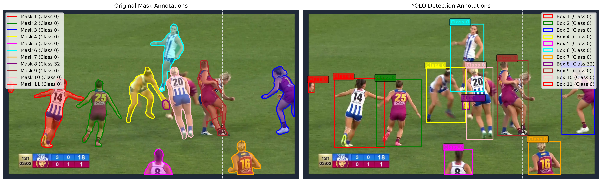

<h1 align="center">YOLO Auto-Annotation Pipeline</h1>

This project provides a streamlined pipeline for automatically generating image annotations using Ultralytics' detection and segmentation models. The goal is to replace manual annotation, which is often time-consuming and requires a lot of effort, with an automated and efficient solution suitable for training YOLO object detection models.

By combining a YOLO-based detector with a SAM (Segment Anything Model), this tool generates high-quality mask annotations and then converts them into YOLO-format bounding boxes. This approach significantly reduces annotation time, minimizes human effort, and accelerates dataset preparation for computer vision tasks.

## 1. Installation
<pre>git clone https://github.com/sontung2310/YOLO-Auto-Annotation-Pipeline.git
cd project-name
pip install requirements.txt
</pre>

## 2. Generate Mask Annotations Using Ultralytics Data Annotator
Use the script to automatically annotate images with masks using a detection and segmentation model:
<pre> python yolo_annotate.py --data "path/to/images/folder" --det_model yolo11x.pt --sam_model sam2_b.pt --output_dir "path/to/saved/folder" </pre>

## 3. Convert Mask Annotations to Bounding Boxes for YOLO Training
After generating mask annotations, convert them into YOLO-compatible bounding box annotations using:

<pre> python convert_masks_to_yolo.py --data "path/to/images/folder" --annotation_dir "path/to/annotation/folder" --output_dir "path/to/saved/folder" </pre>

For example:

<pre> python convert_masks_to_yolo.py --data afl_frames --annotation_dir afl_frames_auto_annotate_labels --output_dir afl_frames_yolo </pre>

The bounding box annotations for training YOLO are now saved in "path/to/saved/folder". You can use these annotations to train any YOLO version without manual labeling, saving you valuable time and effort.

## Example result
The annotated masks and bounding boxes are visualized on the original image to verify the accuracy of the annotation pipeline.

